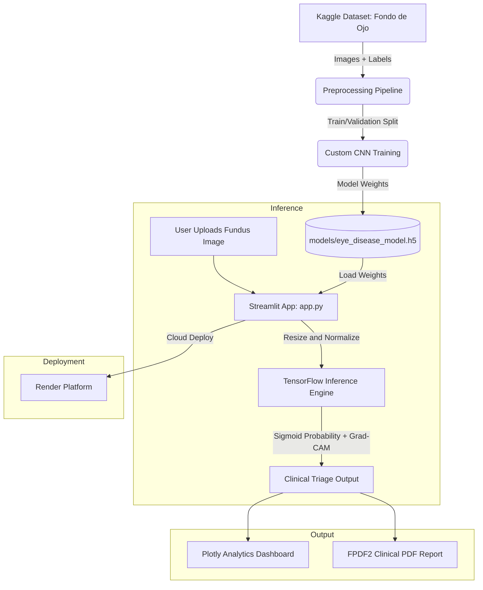

# EYESENTINEL | Clinical Triage & Ocular Diagnosis System

EYESENTINEL is a high-performance, dark-themed clinical triage and multi-disease ocular diagnostic application built using Streamlit, TensorFlow/Keras, Plotly, and FPDF2. It is optimized for rapid cloud deployment (such as Render) and is designed to assist clinicians in screening retinal fundus images for Glaucoma, Diabetic Retinopathy, Cataract, and normal baseline variations.

---

## Key Features

* **AI-Powered Deep Learning Inference**: Utilizes a custom sequential/functional CNN architecture to analyze retinal scan features.
* **Grad-CAM Visual Heatmaps**: Generates attention activation overlays to highlight exact regions (such as the optic nerve head and optic cup) that influenced the model's risk score.
* **Multiclass Ocular Expansion**: Supports both binary glaucoma screening and a multi-disease classification scope.
* **Interactive Analytics Dashboard**: Built with Plotly to visualize triage volume trends, disease distributions, and model performance metrics.
* **Automated Clinical PDF Reporting**: Generates downloadable medical audit reports instantly using FPDF2.

---

## System Architecture



GitHub renders this diagram automatically wherever the README is viewed. The pipeline runs in three phases:

1. **Data + training**: the Kaggle fundus dataset is preprocessed and used to train the custom CNN, producing the `eye_disease_model.h5` artifact.
2. **Inference**: the Streamlit app loads that artifact, takes a user-uploaded fundus image, and runs it through the TensorFlow inference engine to produce a risk score plus a Grad-CAM heatmap.
3. **Output + deployment**: results feed the Plotly dashboard and FPDF2 report generator, with the whole app deployed on Render.

---

## Project Structure

```text
EYESENTINEL/
│
├── app.py                  # Main Streamlit dashboard application
├── config.py               # Centralized configuration, paths, and hyperparameters
├── evaluation.py           # Quantitative model evaluation and performance metrics script
├── models/
│   └── eye_disease_model.h5 # Trained model weights artifact
├── reports/                # Generated evaluation matrices and logs
├── requirements.txt        # Python dependency manifest
└── README.md               # Project documentation

```

---

## Installation & Setup

1. **Clone the Repository / Open Project Directory**:
```bash
cd hackathon-project

```


2. **Install Dependencies**:
Make sure you have Python installed, then install the required libraries:
```bash
pip install -r requirements.txt

```


*(Ensure `fpdf2` is explicitly installed if managing dependencies manually)*
3. **Verify Model Weights**:
Ensure your trained weights file (`eye_disease_model.h5`) is placed inside the `models/` directory.

---

## Running the Application

To launch the Streamlit interface locally, execute:

```bash
streamlit run app.py

```

Open the local URL provided in your terminal (typically `http://localhost:8501`) to access the cyber-medical diagnostic interface.

---

## Model Evaluation

To evaluate model metrics (Confusion Matrix, ROC-AUC score, and Classification Report) on test data, run the evaluation script:

```bash
python evaluation.py

```